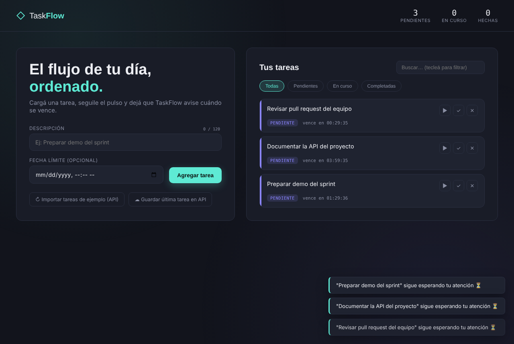
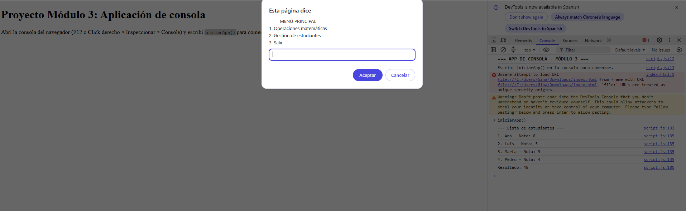
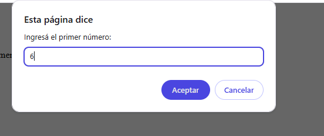

# Gina Ríos · Portafolio técnico

**Ingeniera en Informática, mención Ciencia de Datos (DuocUC)**
Desarrolladora con experiencia en IA agéntica, desarrollo fullstack, desarrollo móvil y soluciones en la nube.

Este portafolio reúne tres proyectos desarrollados durante mi formación técnica, con un caso de estudio detallado: **TaskFlow**.

---

## Sobre mí

Durante mi práctica profesional (enero a marzo de 2026) diseñé y desarrollé de forma independiente una plataforma web multi-agente de IA para orquestar y monitorear entornos cloud, usando Python, Next.js y APIs de Microsoft Azure. Cuento con la certificación **Reinvention with Agentic AI** (Stanford).

Busco seguir creciendo como **Talento Junior Tech**, construyendo soluciones inteligentes que resuelvan problemas reales.

**Habilidades técnicas:** Python · JavaScript · TypeScript · Java · SQL · Node.js · Next.js · React Native · Vue 3 · Firebase · Azure · Git

**Idiomas:** español e inglés

## Contacto

- Correo: rioscarvajal.gi@gmail.com
- LinkedIn: [linkedin.com/in/gina-ríos-420](https://www.linkedin.com/in/gina-r%C3%ADos-420)
- GitHub: [github.com/gros9-car](https://github.com/gros9-car)
- Ubicación: Santiago, Chile · Disponible para trabajo remoto

---

## Proyectos

| Proyecto | Descripción | Tecnologías | Código |
|---|---|---|---|
| **Aplicación de consola** (Módulo 3) | Menú interactivo con operaciones matemáticas y gestión de estudiantes, con validación de datos. | JavaScript, HTML | [Ver código](./app-consola-modulo3) |
| **TaskFlow** (Módulo 4) · *caso de estudio* | App web de gestión de tareas con fecha límite, cuenta regresiva, consumo de API y persistencia. | JavaScript ES6+, HTML5, CSS3, fetch API, localStorage | [Ver código](./taskflow) |
| **BookList SPA** (Módulo 6) | Aplicación de una sola página para una editorial: catálogo de libros, formulario reactivo y detalle por rutas dinámicas. | Vue 3, Vue Router, Vite | [Ver código](./booklist-spa) |

---

## Caso de estudio: TaskFlow

<!-- Agrega aquí una captura de TaskFlow:  -->

### Descripción de la actividad
El Departamento de Desarrollo Web solicitó una aplicación para gestionar tareas de forma eficiente. Desarrollé **TaskFlow**, una app web que permite crear, editar, completar, poner en curso y eliminar tareas, asignarles una fecha límite con cuenta regresiva, filtrar y buscar en vivo, e importar tareas de ejemplo desde una API externa. Los datos se conservan al recargar la página.

### Desafío principal
Integrar en una sola aplicación, sin frameworks, cuatro temas a la vez: orientación a objetos, manipulación del DOM y eventos, asincronía y consumo de APIs. Lo difícil fue mantener todo coordinado: que los temporizadores de cada tarea se detuvieran al completarla o eliminarla, que los datos guardados volvieran a ser objetos con sus métodos al recargar, y que los errores de red se informaran al usuario sin romper la aplicación.

### Solución propuesta
Separé las responsabilidades en dos clases y una capa de interfaz:

- **Clase `Tarea`:** guarda los datos (id, descripción, estado, fechas) y su lógica: cambiar de estado, saber si está vencida y convertirse a JSON y volver a objeto (`toJSON` / `fromJSON`).
- **Clase `GestorTareas`:** administra la lista en una propiedad privada (`#tareas`) y ofrece agregar, editar, eliminar, filtrar, contadores, guardado en `localStorage` y conexión con la API.
- **Interfaz:** eventos `submit`, `click`, `mouseover`, `mouseout` y `keyup`. Usé delegación de eventos en la lista (un solo listener con `data-action`) en vez de uno por botón.
- **Asincronía:** `setTimeout` para simular la latencia al crear una tarea y mostrar un recordatorio; `setInterval` para la cuenta regresiva, con `clearInterval` al completar o eliminar; `async/await` con `try/catch` para la API.

### Herramientas técnicas utilizadas
JavaScript moderno (ES6+) sin frameworks, HTML5 y CSS3. Para los datos externos, la fetch API contra [JSONPlaceholder](https://jsonplaceholder.typicode.com/) (consulta con GET y envío con POST) y `localStorage` para la persistencia. Desarrollo en VS Code con Live Server y verificación de sintaxis con `node --check`.

### Principales aprendizajes
- Encapsular datos con propiedades privadas y reconstruir objetos desde JSON.
- Delegar eventos y manejar el ciclo de vida de los temporizadores para evitar procesos activos innecesarios.
- Trabajar con `async/await` y `try/catch`, y comunicar los errores al usuario con mensajes claros (toasts).
- Separar la lógica de datos de la interfaz, lo que facilita mantener y ampliar el código.
- Documentar el trabajo: elaboré un [informe técnico](./taskflow/INFORME.md) que explica cada decisión y cómo probar la aplicación.

### Métricas de impacto
- **5 de 5** bloques de la consigna cubiertos: POO, ES6+, DOM y eventos, asincronía y API.
- **2 clases** con más de 15 métodos y propiedades en total, en un archivo JavaScript de unas 490 líneas.
- **5 tipos de evento** implementados (`submit`, `click`, `mouseover`, `mouseout`, `keyup`).
- **2 conexiones a API** (GET y POST) con manejo de errores.
- **0 dependencias** y sin proceso de instalación: se abre directamente en el navegador.
- **Persistencia:** el estado de las tareas se mantiene al recargar la página.

### Habilidades técnicas aplicadas
Programación orientada a objetos en JavaScript, sintaxis ES6+ (`let`/`const`, template literals, arrow functions, destructuring, spread/rest), manipulación del DOM, manejo de eventos, programación asíncrona, consumo de APIs REST, almacenamiento local, manejo de errores y documentación técnica.

### Por qué elegí este proyecto para mi portafolio
Es el proyecto más completo del curso y el que mejor muestra mi crecimiento técnico: reúne POO, asincronía y APIs en una aplicación funcional. Además se relaciona con el trabajo en equipos tecnológicos: una app de gestión de tareas dialoga con herramientas como Jira o Trello, trabaja con APIs y exige orden, buenas prácticas y documentación.

### Cómo probarlo
Descarga la carpeta [`taskflow`](./taskflow) y abre `index.html` en el navegador (doble clic o con Live Server en VS Code). No requiere instalación.

---

## Otros proyectos

### Aplicación de consola · Módulo 3

Programa en JavaScript que corre en la consola del navegador. Combina dos módulos desde un menú principal con `prompt()`:

1. **Operaciones matemáticas:** suma, resta, multiplicación, división (controlando la división por cero) y potencia.
2. **Gestión de estudiantes:** listado, filtrado de aprobados, cálculo del promedio y alta de nuevos estudiantes.

Aplica `let`/`const`, `if/else`, `switch`, bucles `for`, `while` y `forEach`, funciones, arreglos de objetos y validación de datos en cada entrada.

| Menú principal | Ingreso de datos |
|---|---|
|  |  |

**Cómo ejecutarlo:** abre `index.html`, abre la consola del navegador (F12), escribe `iniciarApp()` y sigue las instrucciones. Más detalle en el [README del proyecto](./app-consola-modulo3/README.md) y en el [informe técnico](./app-consola-modulo3/Informe_Tecnico_Modulo3_AppConsola.pdf).

### BookList SPA · Módulo 6

Prototipo de una aplicación de una sola página (SPA) para la Editorial Nova, hecha con **Vue 3**, **Vue Router** y **Vite**.

- Formulario con `v-model` (título, autor, categoría y notas) con vista previa en tiempo real.
- Lista reactiva de libros con `v-for`, filtros y eliminación con `@click`.
- Tres vistas con navegación: inicio, lista de libros y detalle por ruta dinámica (`/libros/:id`).
- Estado compartido con un *composable* basado en `reactive()`, sin librerías adicionales.

**Cómo ejecutarlo:**

```bash
cd booklist-spa
npm install
npm run dev
```

Más detalle en el [README del proyecto](./booklist-spa/README.md).

---

*Portafolio actualizado en octubre de 2026.*
